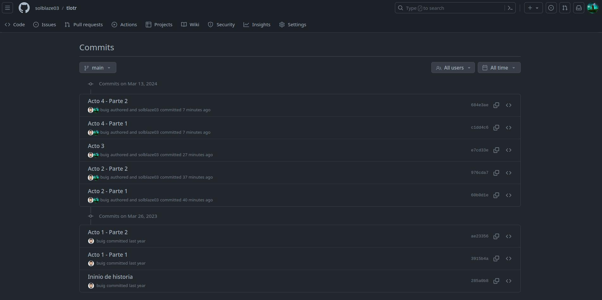

# Ejercicio git tlotr
## Ejercicio 2
* git clone tlotr.git tlotr
* git checkout -b acto3
* git checkout main
* git reset --hard HEAD^
* git checkout -t origin/acto1
* git checkout main
* git merge acto1
* git checkout -t origin/acto2
* git rebase main
Corregir conflictos
* git add .; git rebase --continue
Corregir conflictos acto 2 parte 2
* git add .; git rebase --continue
* git checkout main
* git merge acto2
* git checkout acto3
* git rebase main
Corregir conflicto
* git add .; git rebase --continue
* git checkout main
* git merge acto3
## Ejercicio 3
* git checkout -t origin/acto4
* git rebase main
Corregir conflictos
* git add .;git rebase --continue
Corregir conflictos Acto4 - parte 2
* git add .;git rebase --continue
* git checkout main
* git cherry-pick 8c5a422 12bc4d3

